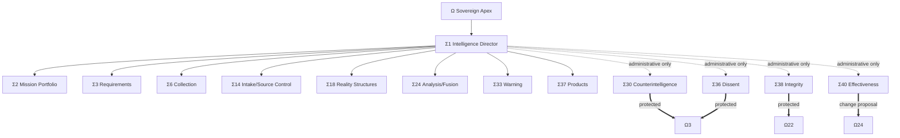

# Authority Graph

```mermaid
flowchart TB
  O[Ω Sovereign Apex] --> S1[Σ1 Intelligence Director]
  S1 --> S2[Σ2 Mission Portfolio]
  S1 --> S3[Σ3 Requirements]
  S1 --> S6[Σ6 Collection]
  S1 --> S14[Σ14 Intake/Source Control]
  S1 --> S18[Σ18 Reality Structures]
  S1 --> S24[Σ24 Analysis/Fusion]
  S1 --> S33[Σ33 Warning]
  S1 --> S37[Σ37 Products]
  S1 -.administrative only.-> S30[Σ30 Counterintelligence]
  S1 -.administrative only.-> S36[Σ36 Dissent]
  S1 -.administrative only.-> S38[Σ38 Integrity]
  S1 -.administrative only.-> S40[Σ40 Effectiveness]
  S30 ==protected==> O3[Ω3]
  S36 ==protected==> O3
  S38 ==protected==> O22[Ω22]
  S40 ==change proposal==> O24[Ω24]
```

Authority does not imply information flow or verdict control.

