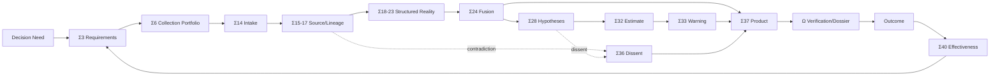

# Information Flow Graph

```mermaid
flowchart LR
  D[Decision Need] --> R[Σ3 Requirements]
  R --> C[Σ6 Collection Portfolio]
  C --> I[Σ14 Intake]
  I --> S[Σ15-17 Source/Lineage]
  S --> X[Σ18-23 Structured Reality]
  X --> F[Σ24 Fusion]
  F --> H[Σ28 Hypotheses]
  H --> E[Σ32 Estimate]
  E --> W[Σ33 Warning]
  F --> P[Σ37 Product]
  W --> P
  P --> O[Ω Verification/Dossier]
  O --> Y[Outcome]
  Y --> Q[Σ40 Effectiveness]
  Q --> R
  S -.contradiction.-> Z[Σ36 Dissent]
  H -.dissent.-> Z
  Z --> P
```

