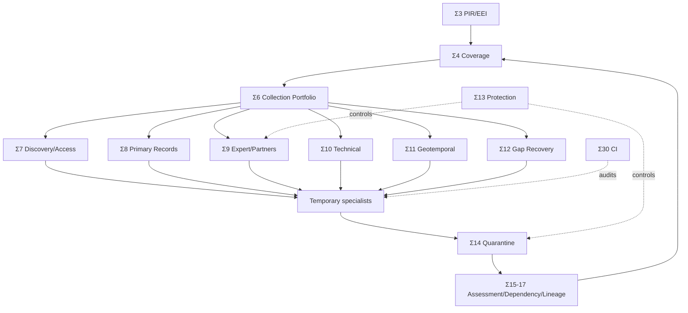

# Collection and Specialist Graph

```mermaid
flowchart TB
  PIR[Σ3 PIR/EEI] --> CV[Σ4 Coverage]
  CV --> CP[Σ6 Collection Portfolio]
  CP --> A[Σ7 Discovery/Access]
  CP --> D[Σ8 Primary Records]
  CP --> E[Σ9 Expert/Partners]
  CP --> T[Σ10 Technical]
  CP --> G[Σ11 Geotemporal]
  CP --> R[Σ12 Gap Recovery]
  A & D & E & T & G & R --> SP[Temporary specialists]
  SP --> Q[Σ14 Quarantine]
  Q --> DEP[Σ15-17 Assessment/Dependency/Lineage]
  DEP --> CV
  S13[Σ13 Protection] -.controls.-> E
  S13 -.controls.-> Q
  S30[Σ30 CI] -.audits.-> SP
```

