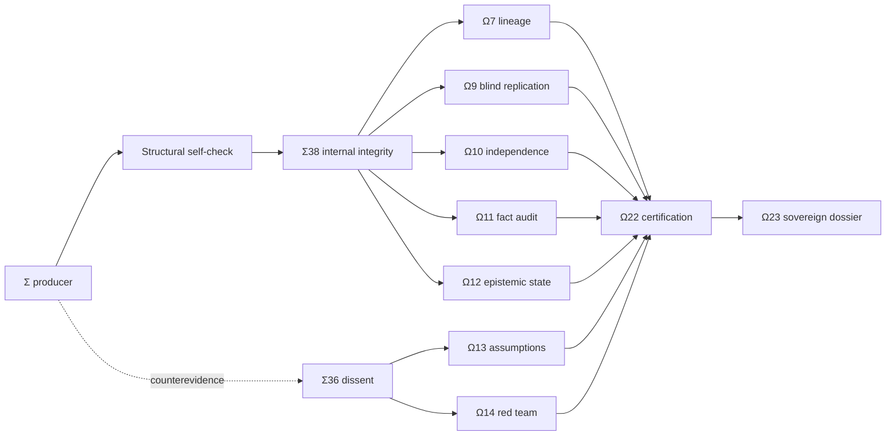

# Verification and Dissent Graph

```mermaid
flowchart LR
  PROD[Σ producer] --> SELF[Structural self-check]
  SELF --> INT[Σ38 internal integrity]
  PROD -.counterevidence.-> DIS[Σ36 dissent]
  INT --> O7[Ω7 lineage]
  INT --> O9[Ω9 blind replication]
  INT --> O10[Ω10 independence]
  INT --> O11[Ω11 fact audit]
  INT --> O12[Ω12 epistemic state]
  DIS --> O13[Ω13 assumptions]
  DIS --> O14[Ω14 red team]
  O7 & O9 & O10 & O11 & O12 & O13 & O14 --> O22[Ω22 certification]
  O22 --> O23[Ω23 sovereign dossier]
```

