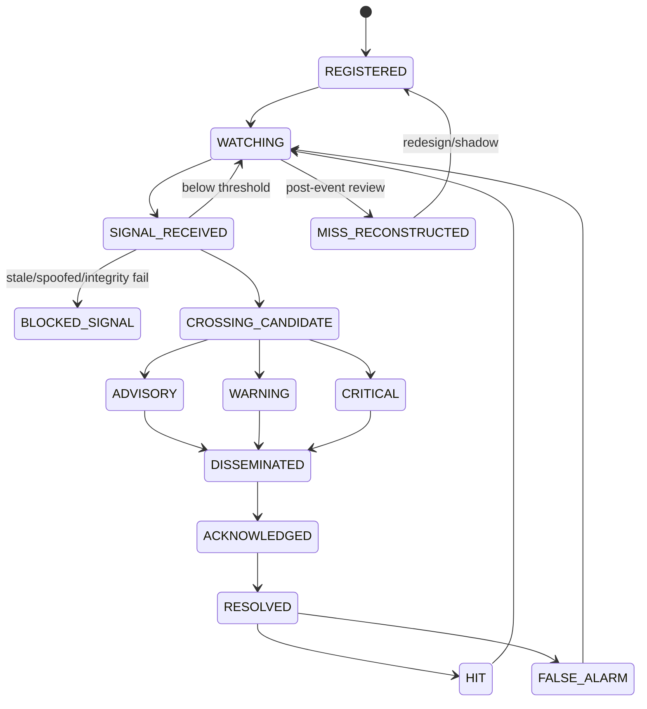

# Indications and Warning Graph

```mermaid
stateDiagram-v2
  [*] --> REGISTERED
  REGISTERED --> WATCHING
  WATCHING --> SIGNAL_RECEIVED
  SIGNAL_RECEIVED --> BLOCKED_SIGNAL: stale/spoofed/integrity fail
  SIGNAL_RECEIVED --> WATCHING: below threshold
  SIGNAL_RECEIVED --> CROSSING_CANDIDATE
  CROSSING_CANDIDATE --> ADVISORY
  CROSSING_CANDIDATE --> WARNING
  CROSSING_CANDIDATE --> CRITICAL
  ADVISORY --> DISSEMINATED
  WARNING --> DISSEMINATED
  CRITICAL --> DISSEMINATED
  DISSEMINATED --> ACKNOWLEDGED
  ACKNOWLEDGED --> RESOLVED
  RESOLVED --> HIT
  RESOLVED --> FALSE_ALARM
  WATCHING --> MISS_RECONSTRUCTED: post-event review
  HIT --> WATCHING
  FALSE_ALARM --> WATCHING
  MISS_RECONSTRUCTED --> REGISTERED: redesign/shadow
```

