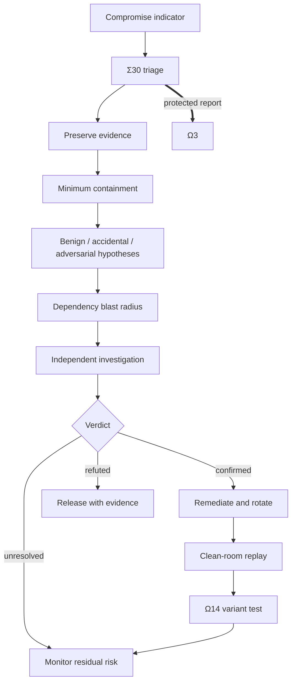

# Counterintelligence Graph

```mermaid
flowchart TB
  SIG[Compromise indicator] --> TRI[Σ30 triage]
  TRI --> PRES[Preserve evidence]
  PRES --> CONT[Minimum containment]
  CONT --> HYP[Benign / accidental / adversarial hypotheses]
  HYP --> BLAST[Dependency blast radius]
  BLAST --> INV[Independent investigation]
  INV --> C{Verdict}
  C -->|confirmed| REM[Remediate and rotate]
  C -->|refuted| REL[Release with evidence]
  C -->|unresolved| MON[Monitor residual risk]
  REM --> CLEAN[Clean-room replay]
  CLEAN --> VAR[Ω14 variant test]
  VAR --> MON
  TRI ==protected report==> O3[Ω3]
```

