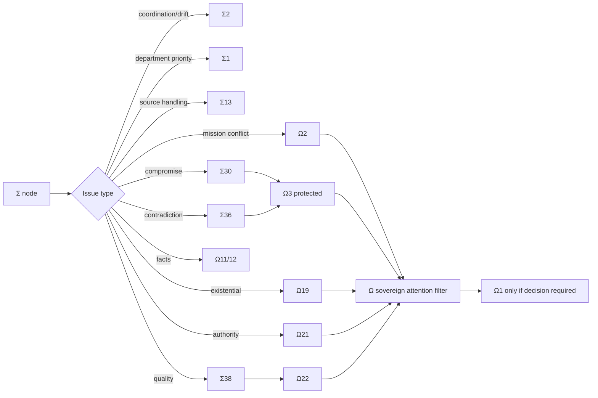

# Escalation Graph

```mermaid
flowchart LR
  N[Σ node] --> T{Issue type}
  T -->|coordination/drift| S2[Σ2]
  T -->|department priority| S1[Σ1]
  T -->|source handling| S13[Σ13]
  T -->|compromise| S30[Σ30]
  T -->|contradiction| S36[Σ36]
  T -->|quality| S38[Σ38]
  T -->|authority| O21[Ω21]
  T -->|facts| O11[Ω11/12]
  T -->|existential| O19[Ω19]
  T -->|mission conflict| O2[Ω2]
  S30 --> O3[Ω3 protected]
  S36 --> O3
  S38 --> O22[Ω22]
  O2 & O3 & O19 & O21 & O22 --> F[Ω sovereign attention filter]
  F --> O1[Ω1 only if decision required]
```

