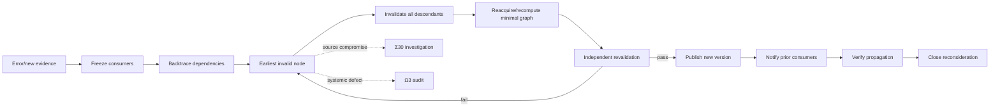

# Failure and Root-Cause Recovery Graph

```mermaid
flowchart LR
  ERR[Error/new evidence] --> FR[Freeze consumers]
  FR --> BACK[Backtrace dependencies]
  BACK --> ROOT[Earliest invalid node]
  ROOT --> INV[Invalidate all descendants]
  INV --> REC[Reacquire/recompute minimal graph]
  REC --> REV[Independent revalidation]
  REV -->|fail| ROOT
  REV -->|pass| NEW[Publish new version]
  NEW --> NOT[Notify prior consumers]
  NOT --> ACK[Verify propagation]
  ACK --> CLOSE[Close reconsideration]
  ROOT -.source compromise.-> CI[Σ30 investigation]
  ROOT -.systemic defect.-> O3[Ω3 audit]
```

